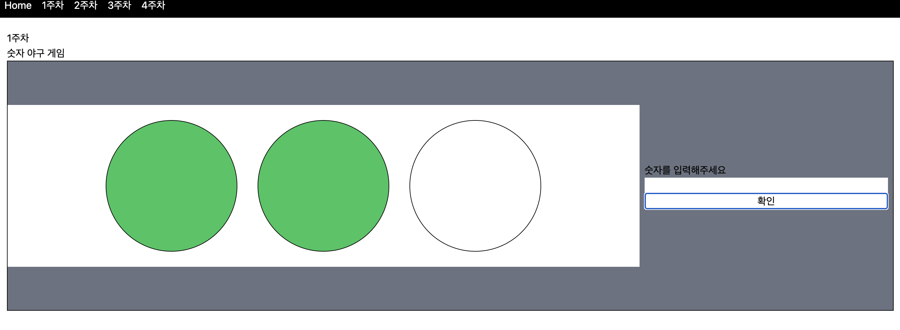

# woowa-pre-use
우아한테크코스 프리코스 활용 레포지토리입니다.\n 각 주차 별로 생성된 미션을 매우 간단한 웹 프로젝트로 만들어봅니다.

## 기술스택
- React
- Next JS 13
- TailWindCSS

## 1주차 미션 - 숫자 야구 만들기
[자세한 내용](https://github.com/leeyulgok/javascript-baseball-6)\n

위의 사진과 같이 사용자가 값을 입력하면 strike와 ball에 따라 바뀌도록 만들었습니다.
자세한 코드는 components/WeekOne.tsx 를 보면 나와있습니다.
