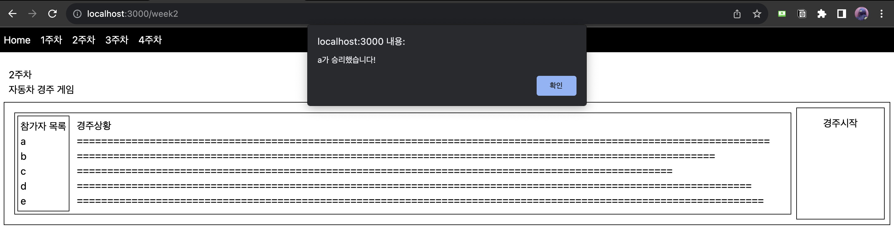

# woowa-pre-use
우아한테크코스 프리코스 활용 레포지토리입니다. 각 주차 별로 생성된 미션을 매우 간단한 웹 프로젝트로 만들어봅니다.

## 기술스택
- React
- Next JS 13
- TailWindCSS

## 1주차 미션 - 숫자 야구 만들기
[자세한 내용](https://github.com/leeyulgok/javascript-baseball-6)

위의 사진과 같이 사용자가 값을 입력하면 strike와 ball에 따라 바뀌도록 만들었습니다.
자세한 코드는 components/WeekOne.tsx 를 보면 나와있습니다.

---
## 2주차 미션 - 자동차 경주 게임
[자세한 내용](https://github.com/leeyulgok/javascript-racingcar-6)

미션과 100% 똑같지는 않지만, 웹 프로그램은 다음과 같습니다.
1. 참가자 입력(최대 5명)
   - '+'버튼을 누르면 참가자를 입력하는 input 태그 생성
   - '확정' 버튼을 통해 참가자를 확정
2. 경주시작 버튼으로 게임 시작
   - 경주가 시작되면 115를 가장 먼저 채우는 쪽이 승리(가장 끝에서 끝)
   - 승리자가 alert로 표시됨

---
